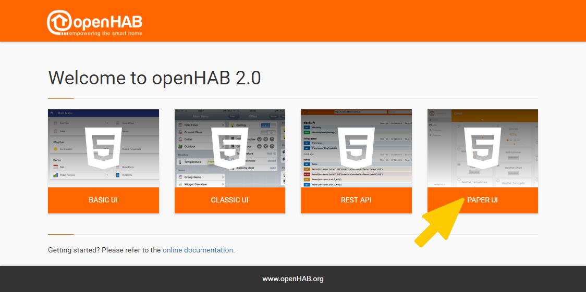
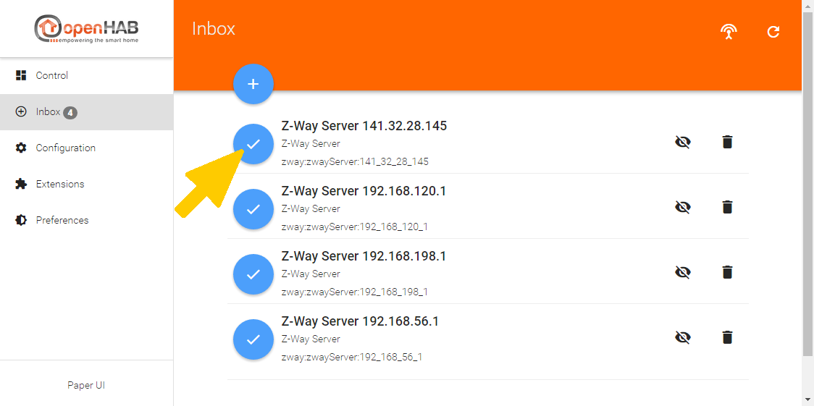
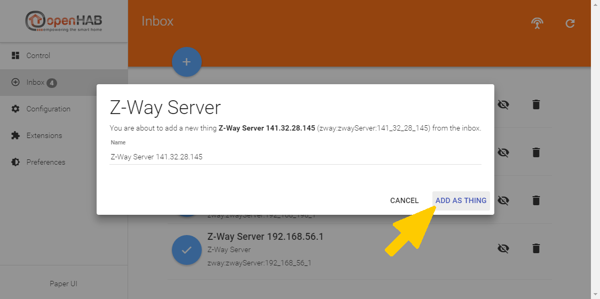
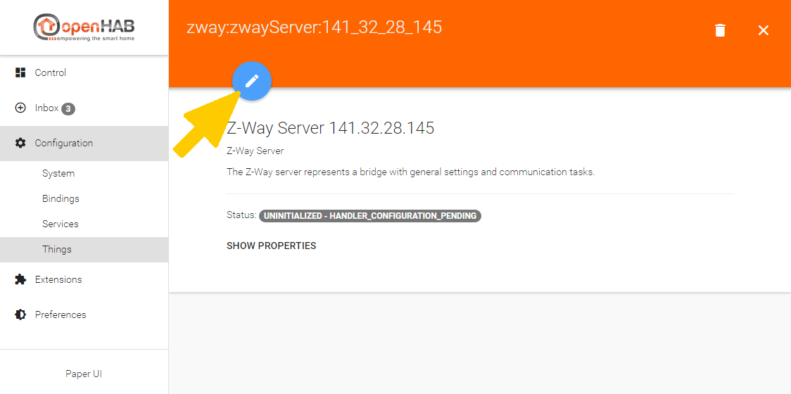
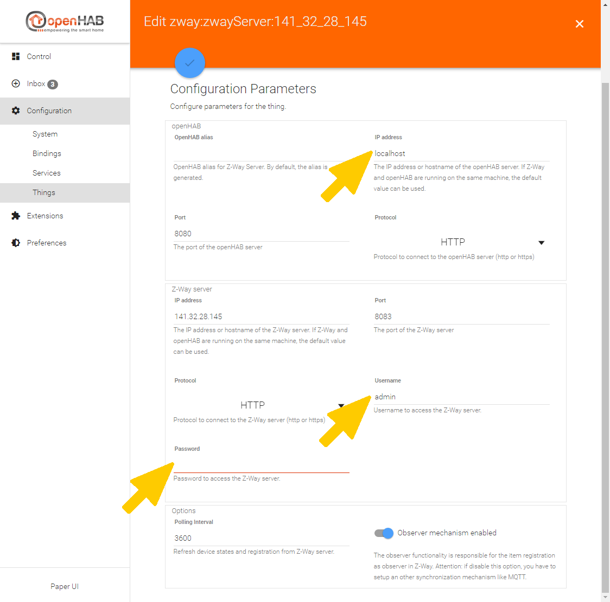
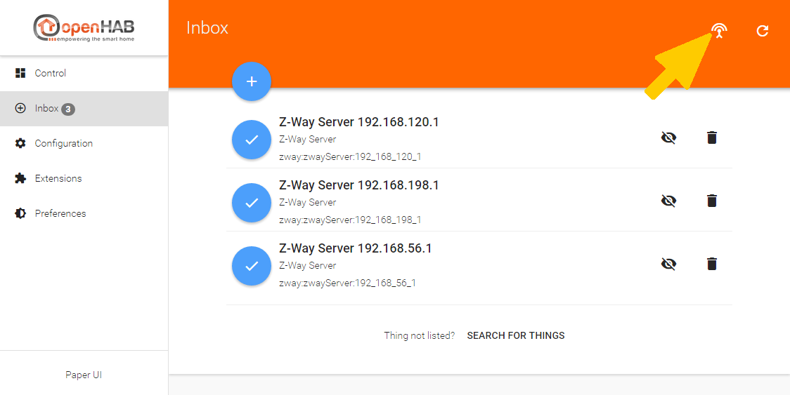
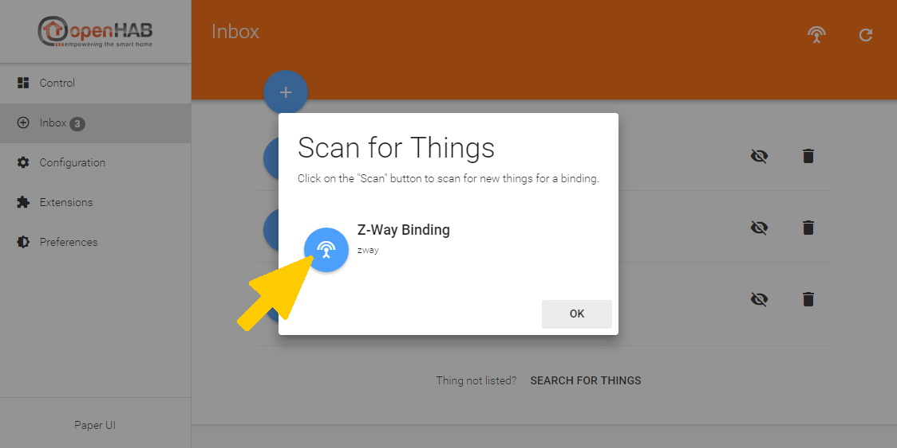
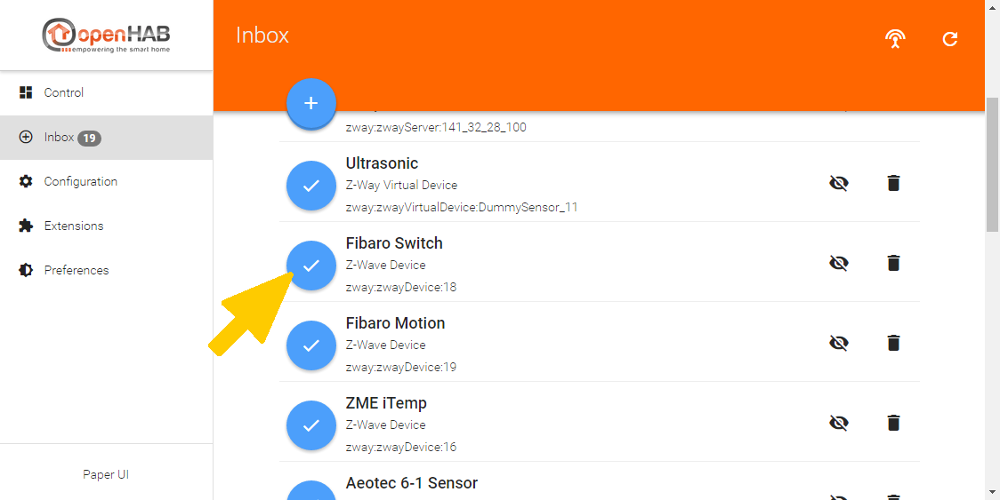
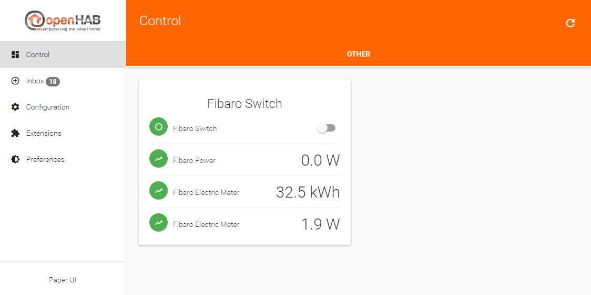
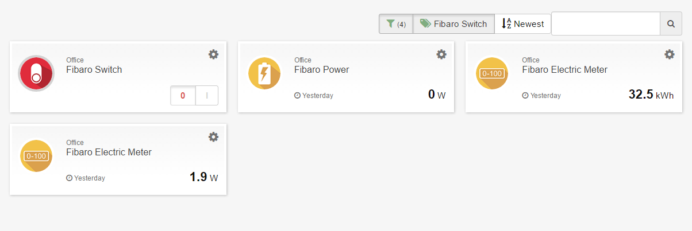

# Getting Started

# Prepare Z-Way Server

1. [Download](https://razberry.z-wave.me/z-way-server/) Z-Way v2.2.3 or newer (further information about installing Z-Way you can find [here](http://razberry.z-wave.me/index.php?id=24))

# Prepare openHAB

1. [Download](https://www.openhab.org/download/) openHAB 2 (further information about installing openHAB you can find [here](https://www.openhab.org/docs/installation/))
2. Install Z-Way Binding
    - via Extension Manager
    - via Download

    ```shell
    cd /opt/openhab2/addons
    sudo wget https://github.com/openhab/openhab2-addons/files/636686/org.openhab.binding.zway-2.0.0-SNAPSHOT.zip
    sudo unzip org.openhab.binding.zway-2.0.0-SNAPSHOT.zip
    sudo rm org.openhab.binding.zway-2.0.0-SNAPSHOT.zip
    ```

3. Start openHAB by running `start.bat` or `start.sh`
4. The first start may take up to 5 minutes. You should reach openHAB2 at `http://localhost:8080`

# Configure Z-Way in openHAB

## Create and configure a Z-Way Bridge

Open the *Paper UI*



Open the *Inbox* and create a Z-Way Server





Open the *Configuration* - *Things* and select Z-Way Server



Change configuration: In order for the Observer mechanism works, the IP address, port and protocol of both systems are required.

- **Z-Way Server**
    - **IP address** (default: localhost)
    - **port** (default: 8083)
    - **protocol** (default: http)
    - **username** (default: admin)
    - **password** must be set (no default value)
- **options**
    - **polling interval** (default: 3600) in seconds

**The following picture is no longer up to date!**


## Create and configure Z-Way Devices

Open the *Inbox* and start manually the *Discovery* for the Z-Way Binding. The *Discovery* must be started manually at this point, because the *Discovery* is running only every 4 minutes. The start time of the interval is the creation of Z-Way Server, even if the configuration is not yet complete. After the Z-Way Server is fully configured, the interval must be awaited or started manually.





Create *Things* from the *Discovery Results*



Example: openHAB *Thing* compared to the equivalent Z-Way *Devices*




